# The Dead Swan

The Dead Swan was created as my first milestone project for the Code Institutes Level 5 Diploma in Web Application Development. The site is designed to showcase a fictional bar and restaurant in the Welsh town of Brecon. The site contains information about the history and ethos of the business, a kitchen menu, a gallery page, a booking form and contact information. 

Link to deployed site: 
https://llywelyn1282.github.io/the-dead-swan/index.html

 


## CONTENTS

* [Design](#design)
  * [Colour Scheme](#colour-scheme)
  * [Typography](#typography)
  * [Imagery](#imagery)
  * [Wireframes](#wireframes)

* [Features](#features)
  * [Elements Found on Each Page](#elements-found-on-each-page)
  * [Future Implementations](#future-implementations)

* [Technologies Used](#technologies-used)
  * [Languages Used](#languages-used)
  * [Databases Used](#databases-used)
  * [Frameworks Used](#frameworks-used)
  * [Libraries & Packages Used](#libraries--packages-used)
  * [Programs Used](#programs-used)

* [Testing](#testing)
  * [Responsiveness](#responsiveness)
  * [Accesibility](#accessibility)
  * [Lighthouse Testing](#lighthouse-testing)
  * [Functional Testing](#functional-testing)
  * [Validator Testing](#validator-testing)
  * [Fixed Bugs](#fixed-bugs)
  * [Unfixed Bugs](#unfixed-bugs)


* [Deployment & Local Development](#deployment--local-development)
  * [Deployment](#deployment)
  * [Local Development](#local-development)
    * [How to Clone](#how-to-clone)
  
* [Credits](#credits)
  * [Code Used](#code-used)
  * [Content](#content)
  * [Media](#media)

- - -

## Design

### Colour Scheme


### Typography

I used Google Fonts to import the following fonts for use in the site:

##### Logo & Headings 

[Bokor](https://fonts.google.com/specimen/Bokor)


##### Paragraphs 

[Inter](https://fonts.google.com/specimen/Inter)


##### Icons 

Icons were used from [Font Awesome](https://fontawesome.com/icons)

### Imagery

Favicon generated using [favicon.io](https://favicon.io/) 


### Wireframes

Wireframes were created for mobile and desktop using Balsamiq.

#### __Home Page__


#### __Menu Page__


#### __Gallery Page__


#### __Booking Page__


#### __Booking Request Received Page__


## Features

The website is comprised of 6 pages:

* Home Page
* Menu Page
* Gallery Page
* Booking Page
* Booking Request Received Page
* 404 Page


### Site Wide

__Navbar__
  
* Bootstrap navbar styled to have right sided margin and burger icon on smaller devices. Contains links to Home, Menu, Gallery, Booking and Contact.
  
  

__Footer__

* Footer containing contact information, social media links and opening times for the business is displayed on all pages of the website. 

  

### Home Page

* The home page contains a welcome image of the bar, an about section and two calls to action links to the menu page and the booking page respectively.


### Menu Page

* The menu page displays the current kitchen menu for the restaurant.


### Gallery Page

* The gallery page displays several images of what the establishment has to offer such as the decor, happy patrons, live musicians, food and drink.


### Booking Page

* The booking page contains a booking form for users to be able to request a table at the restaurant.


### Booking Request Received Page

* A page the user will be directed to if they correctly fill out the booking form. The page has a link that allows users to navigate back to the homepage and automatically redirects back to the homepage after 20 seconds.


### 404 Error Page

* A 404 page is in place to display if a user navigates to a broken link. The page has a link that allows users to navigate back to the homepage and automatically redirects back to the homepage after 20 seconds.


### Future Implementations

In future implementations I would like to:

* Update the form element with Javascript to send the form information in the form of an email to the establishment email address.
* Include a newsletter sign up form.
* Intergrate a live feed of social media pages on the site.
* Intergrate the bar's Untappd page to keep potential patients up to date with the drinks on tap.
* To include customer reviews and testimonials of the establishment on the site.

- - -

## Technologies Used

### Languages Used

HTML
   
 * The structure of the Website was developed using HTML as the main language.

CSS
   
 * The Website was styled using custom CSS in an external file.

### Frameworks Used

[Bootstrap](https://getbootstrap.com/)

### Programs Used

[Balsamiq](https://balsamiq.com/) - Used to create wireframes.

[Github](https://github.com/) - To save and store the files for the website.

[Google Fonts](https://fonts.google.com/) - To import the fonts used on the website.

[Favicon.io](https://favicon.io/favicon-converter/) - To create the favicon files.

[Adobe Express](https://www.adobe.com/uk/products/firefly/features/text-to-image.html) - Text to Image AI Generator to create images for the site.

[Tiny JPG](https://tinyjpg.com/) - To resize the website images.

[Font Awesome](https://fontawesome.com/)  - For the icons on the website.

[Google Chrome Dev Tools](https://developer.chrome.com/docs/devtools/) - To troubleshoot and test features, solve issues with responsiveness and styling.

[Am I Responsive?](http://ami.responsivedesign.is/) - To show the website image on a range of devices.

- - - 

## Testing

### Responsiveness

All pages were tested to ensure responsiveness on screen sizes from 320px and upwards as defined in [WCAG 2.1 Reflow criteria for responsive design](https://www.w3.org/WAI/WCAG21/Understanding/reflow.html) on Chrome, Edge, Firefox and Opera browsers.

Steps to test:

1. Open browser and navigate to [The Dead Swan](https://llywelyn1282.github.io/the-dead-swan/index.html)
2. Open the developer tools (right click and inspect)
3. Set to responsive and decrease width to 320px
4. Set the zoom to 50%
5. Click and drag the responsive window to maximum width

Expected:

Website is responsive on all screen sizes and no images are pixelated or stretched.
No horizontal scroll is present.
No elements overlap.

Actual:

Website behaved as expected.

Website was also opened on the following devices and no responsive issues were seen:

- Huawei P20 Pro
- iPad Pro
- Lenovo Ideapad S540

### Accessibility

Wave Accessibility tool was used throughout development and for final testing of the deployed website to check for any aid accessibility testing.

Testing was focused to ensure the following criteria were met:

- All forms have associated labels or aria-labels so that this is read out on a screen reader to users who tab to form inputs
- Color contrasts meet a minimum ratio as specified in WCAG 2.1 Contrast Guidelines
- Heading levels are not missed or skipped to ensure the importance of content is relayed correctly to the end user
- All content is contained within landmarks to ensure ease of use for assistive technology, allowing the user to navigate by page regions
- All not textual content had alternative text or titles so descriptions are read out to screen readers
- HTML page lang attribute has been set
- Aria properties have been implemented correctly
- WCAG 2.1 Coding best practices being followed
- Manual tests were also performed to ensure the website was accessible as possible and an accessibility issue was identified.

### Lighthouse Testing

#### __Home Page__

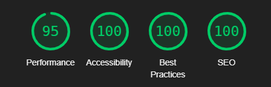

#### __Menu Page__

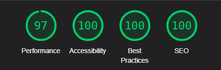

#### __Gallery Page__

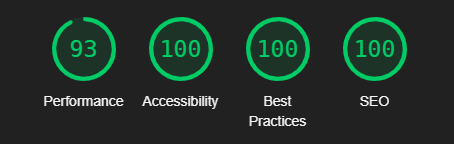

#### __Booking Page__

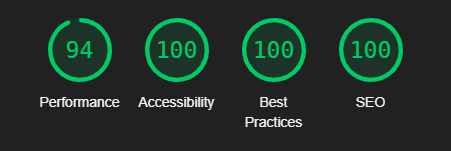

#### __Booking Request Received Page__

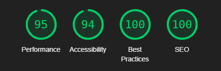

#### __404 Page__

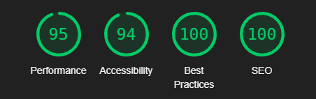


### Functional Testing

**Navigation Links**

Testing was performed to ensure all navigation links on the respective pages, navigated to the correct pages as per design. This was done by clicking on the navigation links on each page.

| Navigation Link | Page to Load        |
| --------------- | ---------------     |
| Home            | index.html          |
| About           | index.html#about    |
| Menu            | menu.html           |
| Gallery         | gallery.html        |
| Booking         | booking.html        |
| Contact         | index.html#booking  |

Links on all pages navigated to the correct pages as exptected.

**Page Links**

- Call to action links on index.html titled "see our menu" and "book a table" both navigated to menu.html and booking.html respecitively.
- Links to social media on gallery.html both functioning correctly and directing to Instagram and Facebook homepages as placeholders.
- The "back to homepage" link on both booking-request-received.html and 404.html is working correctly.

**Form Testing**

The form on the home page was tested to ensure it functioned as expected when correct data was input and when incorrect data was input. The following test scenarios were covered:

_Scenario One - Correct Inputs_

Steps to test:

1. Navigate to [The Dead Swan - Booking](https://llywelyn1282.github.io/the-dead-swan/booking.html)
2. Scroll down to the form and input the following data:
   - First Name: John
   - Last Name: Smith
   - Phone Number: 012345678912
   - Email: name@example.com
   - Party Number: 4
   - Date: 01/01/2025
3. Click Submit
4. User should be redirected to booking-request-received.html confirmation page

Expected:

Form submits with no warnings or errors and user is redirected to booking-request-received.html confirmation page.

Actual:

Website behaved as expected with no errors or warnings and redirected to contact.html.

_Scenario Two - Missing Required Field First Name_

Steps to test:

1. Navigate to [The Dead Swan - Booking](https://llywelyn1282.github.io/the-dead-swan/booking.html)
2. Scroll down to the form and input the following data:
   - First Name: 
   - Last Name: Smith
   - Phone Number: 012345678912
   - Email: name@example.com
   - Party Number: 4
   - Date: 01/01/2025
3. Click Submit
4. User should be given error reading "Please fill out this field."

Expected:

Form lists error on First Name field stating "Please fill out this field."

Actual:

Form lists error on First Name field stating "Please fill out this field."

_Scenario Three - Missing Required Field Last Name_

Steps to test:

1. Navigate to [The Dead Swan - Booking](https://llywelyn1282.github.io/the-dead-swan/booking.html)
2. Scroll down to the form and input the following data:
   - First Name: John
   - Last Name: 
   - Phone Number: 012345678912
   - Email: name@example.com
   - Party Number: 4
   - Date: 01/01/2025
3. Click Submit
4. User should be given error reading "Please fill out this field."

Expected:

Form lists error on Last Name field stating "Please fill out this field."

Actual:

Form lists error on Last Name field stating "Please fill out this field."

_Scenario Four - Missing Required Field Phone Number_

Steps to test:

1. Navigate to [The Dead Swan - Booking](https://llywelyn1282.github.io/the-dead-swan/booking.html)
2. Scroll down to the form and input the following data:
   - First Name: John
   - Last Name: Smith
   - Phone Number: 
   - Email: name@example.com
   - Party Number: 4
   - Date: 01/01/2025
3. Click Submit
4. User should be given error reading "Please fill out this field."

Expected:

Form lists error on Phone Number field stating "Please fill out this field."

Actual:

Form lists error on Phone Number field stating "Please fill out this field."

_Scenario Five - Missing Required Field Email_

Steps to test:

1. Navigate to [The Dead Swan - Booking](https://llywelyn1282.github.io/the-dead-swan/booking.html)
2. Scroll down to the form and input the following data:
   - First Name: John
   - Last Name: Smith
   - Phone Number: 012345678912
   - Email: name@example.com
   - Party Number: 4
   - Date: 01/01/2025
3. Click Submit
4. User should be given error reading "Please fill out this field."

Expected:

Form lists error on Email field stating "Please fill out this field."

Actual:

Form lists error on Email field stating "Please fill out this field."

_Scenario Six - Incorrect email format_

Steps to test:

1. Navigate to [The Dead Swan - Booking](https://llywelyn1282.github.io/the-dead-swan/booking.html)
2. Scroll down to the form and input the following data:
   - First Name: John
   - Last Name: Smith
   - Phone Number: 012345678912
   - Email: nameexample.com
   - Party Number: 4
   - Date: 01/01/2025
3. Click Submit
4. User should be given error reading "Please include an '@' in the email address. 'nameexample.com is missing an '@'."

Expected:

Form lists error on Email field stating "Please include an '@' in the email address. 'nameexample.com is missing an '@'."

Actual:

Form lists error on Email field stating "Please include an '@' in the email address. 'nameexample.com is missing an '@'."

_Scenario Seven - Missing Required Field Party Number_

Steps to test:

1. Navigate to [The Dead Swan - Booking](https://llywelyn1282.github.io/the-dead-swan/booking.html)
2. Scroll down to the form and input the following data:
   - First Name: John
   - Last Name: Smith
   - Phone Number: 012345678912
   - Email: name@example.com
   - Party Number: 4
   - Date: 01/01/2025
3. Click Submit
4. User should be given error reading "Please fill out this field."

Expected:

Form lists error on Party Number field stating "Please fill out this field."

Actual:

Form lists error on Part Number field stating "Please fill out this field."

_Scenario Eight - Missing Required Field Date_

Steps to test:

1. Navigate to [The Dead Swan - Booking](https://llywelyn1282.github.io/the-dead-swan/booking.html)
2. Scroll down to the form and input the following data:
   - First Name: John
   - Last Name: Smith
   - Phone Number: 012345678912
   - Email: name@example.com
   - Party Number: 4
   - Date: dd/mm/yyyy
3. Click Submit
4. User should be given error reading "Please fill out this field."

Expected:

Form lists error on Party Number field stating "Please fill out this field."

Actual:

Form lists error on Part Number field stating "Please fill out this field."

**Footer Social Media Icons / Links**

Instagram and Facebook link both link to the Instagram and Facebook hompages as placeholders respectively.

**Footer Contact Information**

Both the phone number and email links forward in the correct way. 

### Validator Testing 

HTML
  - No errors were returned when passing through the official [W3C Validator](https://validator.w3.org)

  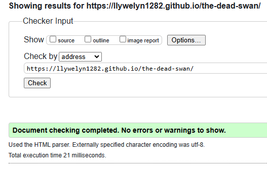
  
  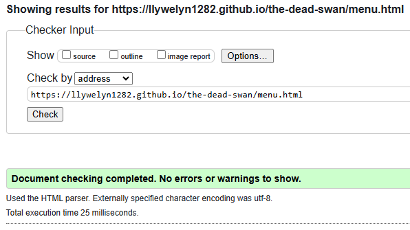

  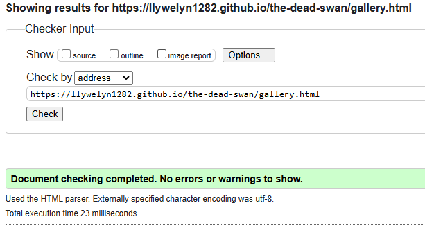

  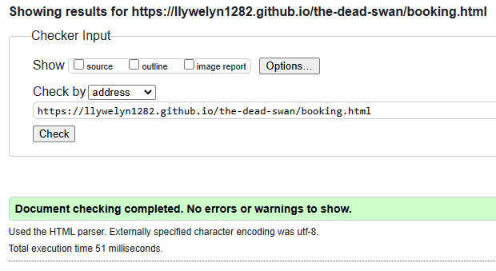

  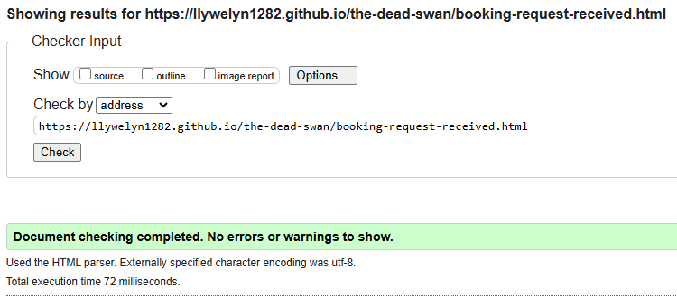

  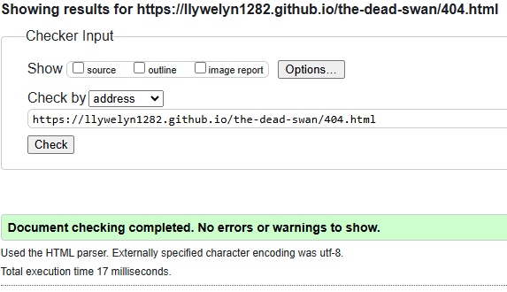

CSS
  - No errors were found when passing through the official [Jigsaw Validator](https://jigsaw.w3.org)
  
  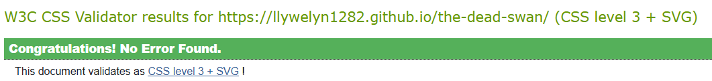

### Fixed Bugs

* Had trouble overriding bootstrap default colors for the navbar. Solution was to use Dev Tools to highlight the effected area and find the correct bootstrap class or id to override in the stylesheet.

* Had issues with the alignment of the footer when using the Bootstrap grid, rebuilt it using flex instead to solve the issue.

* Had issues with the centering of content on the booking-request-received.html and 404.html pages, as the content was instead aligning to the left. Fixed by targeting the parent container as well as the content with the centering command on the stylesheet.

* Had issue with not being able to put lettering or punctation in the desired time part of the form input. Solved by turning it into a multiple choice selector instead.

### Unfixed Bugs

* When live testing a small issue was discovered on tablet sized screens, where on the booking-request-received.html and 404.html pages the footer became detached from the bottom of the screen. This issue does not created any overlapping elements, and plans are for it to be fixed by the next release.

- - -

## Deployment & Local Development

The following git commands were used throughout development to push code to the remote repo:

```git add <file>``` - This command was used to add the file(s) to the staging area before they are committed.

```git commit -m “commit message”``` - This command was used to commit changes to the local repository queue ready for the final step.

```git push``` - This command was used to push all committed code to the remote repository on github.

### Deployment

The site was deployed to GitHub pages. The steps to deploy are as follows: 
  - In the GitHub repository, navigate to the Settings tab 
  - From the menu on left select 'Pages'
  - From the source section drop-down menu, select the Branch: main
  - Click 'Save'
  - A live link will be displayed in a green banner when published successfully. 

The live link can be found here - https://llywelyn1282.github.io/the-dead-swan/index.html

#### How to Clone

Navigate to the GitHub Repository you want to clone to use locally:

- Click on the code drop down button
- Click on HTTPS
- Copy the repository link to the clipboard
- Open your IDE of choice (git must be installed for the next steps)
- Type git clone copied-git-url into the IDE terminal

The project will now of been cloned on your local machine for use.


- - -


## Credits

W3schools page used to learn how to place text over images:

https://www.w3schools.com/howto/howto_css_image_text.asp

Flexbox tutorial used for alignment in footer:

https://www.youtube.com/watch?v=2uvyx4YK_rQ&t=2s

W3schools page used to learn how to link phone number in contact information:

https://www.w3schools.com/tags/tryit.asp?filename=tryhtml_link_phoneto

W3schools page used to learn how to link email address in contact information:

https://www.w3schools.com/tags/tryit.asp?filename=tryhtml_link_mailto

##### Bootstrap Components  

* Bootstrap Grid and Flexbox used across all pages
* Navbar
* Form

### Content

Content for this project was written by Gwilym Llywelyn.

### Media

Media for this website was created using Adobe Express text to image AI Generator.

* Home Page Hero Image [bar-2](assets/images/bar-2.webp)
* Home Page Menu Image [asian-food-1](assets/images/asian-food-1.webp)
* Home Page Booking Image [patrons-5](assets/images/patrons-5.webp)
* Menu Page Hero Image [asian-food-server-3](assets/images/asian-food-server-3.webp)
* Booking Page Hero Image [asian-food-3](assets/images/asian-food-3.webp)
* Gallery Page Image [bar-1](assets/images/bar-1.webp)
* Gallery Page Image [beer-pumps](assets/images/beer-pumps.webp)
* Gallery Page Image [band-image-1](assets/images/band-image-1.webp)
* Gallery Page Image [patrons-2](assets/images/patrons-2.webp)
* Gallery Page Image [dead-swan](assets/images/dead-swan.webp)
* Gallery Page Image [asian-food-3](assets/images/asian-food-3.webp)
* Gallery Page Image [band-image-2](assets/images/band-image-2.webp)
* Gallery Page Image [patrons-4](assets/images/patrons-4.webp)
* Gallery Page Image [patrons-3](assets/images/patrons-3.webp)
* Gallery Page Image [asian-food-server-3](assets/images/asian-food-server-3.webp)
* Gallery Page Image [welcome-sign](assets/images/welcome-sign.webp)
* Gallery Page Image [asian-food-server-4](assets/images/asian-food-server-4.webp)
* Booking Request Received + 404 Image [dead-swan](assets/images/dead-swan.webp)